# BBS_defender  
未名BBS守护者交互式爬虫  
# 逆向成功，正在进行稳定性测试，测试成功后发布  
# ~~暂停维护（官方新加了一个加密过的参数t导致本程序失效，我需要学学JavaScript才能破解）~~  
## 前言  
作者为什么要写这样的一个脚本？  
那是因为我看了这个帖子：https://bbs.pku.edu.cn/v2/post-read.php?bid=138&threadid=18263492
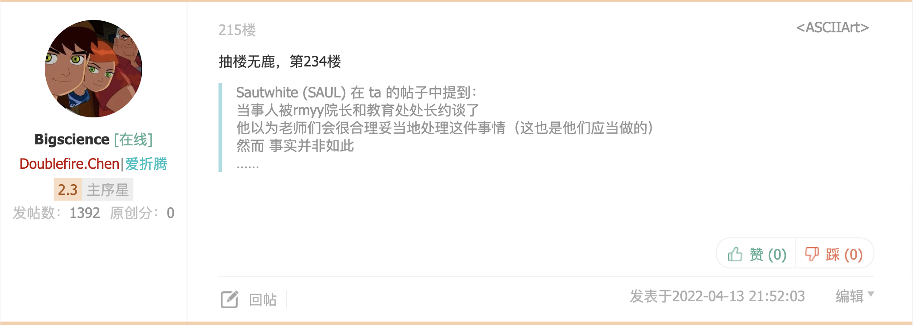  
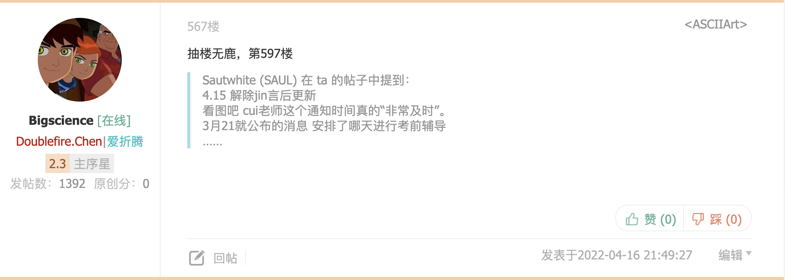  
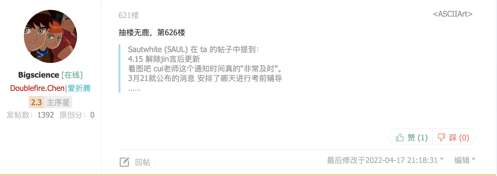  
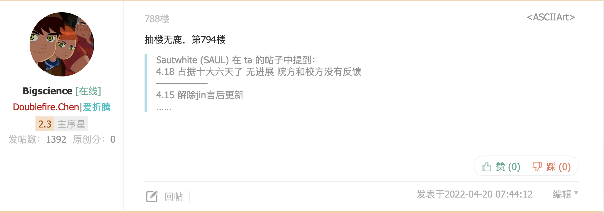  
HSC领导和rmyy领导对于水n的大无畏送鹿精神作出了高度评价，对于水n在此次舆情防控攻坚战上的卓越贡献给予了充分肯定，为表彰水n的所作所为，HSC领导和rmyy领导在心里偷偷地号召BBS全站站友向水n同志学习。（以上内容均为瞎编的（doge））  
作者本人也非常“认可”水n的送鹿精神，但是想了想光表彰有啥用，来点儿实在的东西不行吗，作者突然想起来这学期选了一个Python爬虫选修课，学了一点爬虫知识，于是花了三天时间写了这个四五百行代码的交互式爬虫程序作为锦旗送给水n，有了这个交互式爬虫，水n日后的工作将会有更大的进步空间，一定继续被领导高度表扬的，加油💪🏻💪🏻💪🏻，我看好你哦。  
## 更新（先别用，有bug，因为这个bug，我一下子发了一百多个帖子，被取消了在HSC发帖的权限，😭😭😭，若想用的话把第四个线程删掉。不过这个都是小bug，关键是登陆请求包多了一个加密参数，导致本项目寄了，或许用cookie能短期实现，但是意义不大，anyway，多学习多读书才能更有本事）  
V3.0:  
1. 将守护通知帖半自动复活模式升级为全自动模式  
2. 新增调戏（人机对话）水n功能（可选）  
3. 修复相关bug  

V2.0:  
1. 优化detector函数的检测算法，程序运行效率更高，对服务器压力更小  
2. 自己也可以给自己发站内信了  
3. 修复若干bug  
## 功能介绍  
1. 爬取帖子内容（包括发帖人、发帖内容、引用部分、附件内容、发帖时间、签名档）  
2. 检测被删帖子  
3. 用户交互（包括查看被删帖子、自删免爬、版务删帖免爬）  
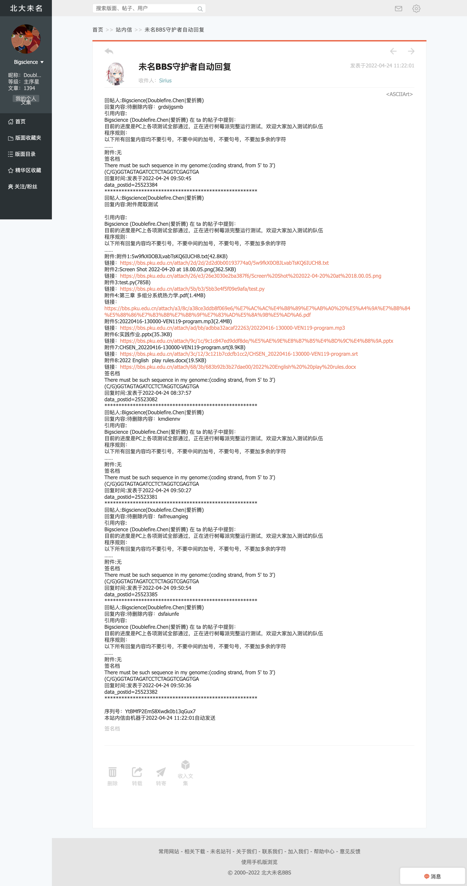
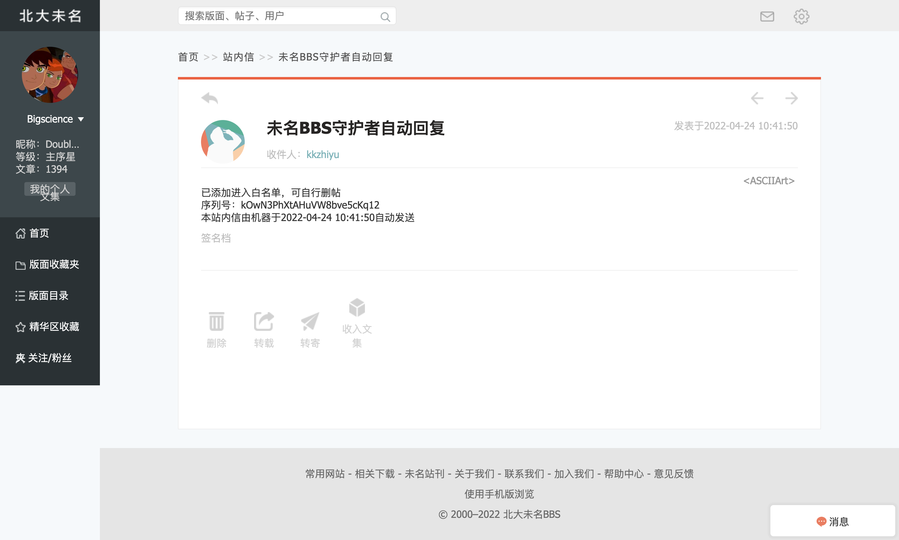
4. 生成日志文件（备份）  
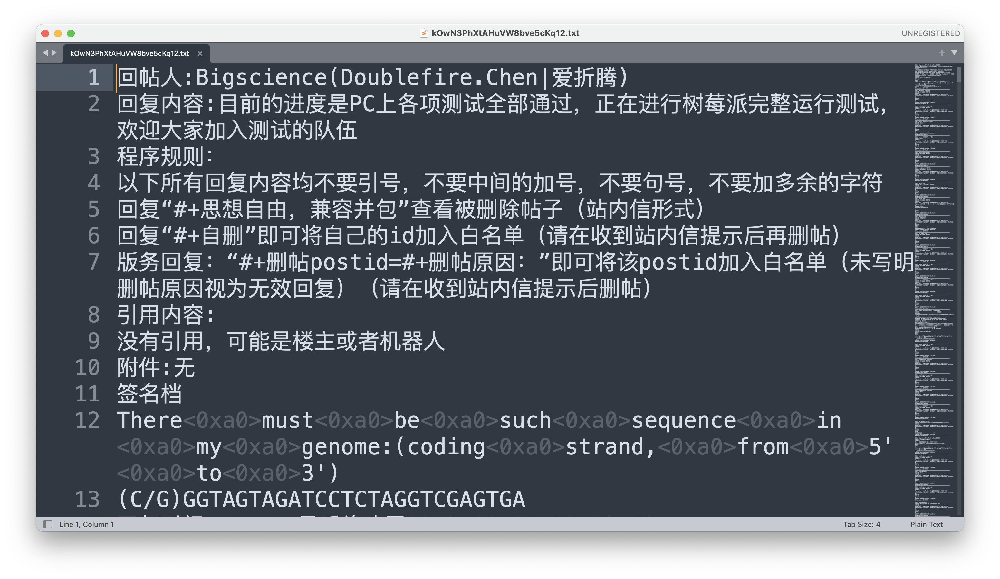
5. 动态操作（加时、减时、手动停止）  
6. 操作通知  
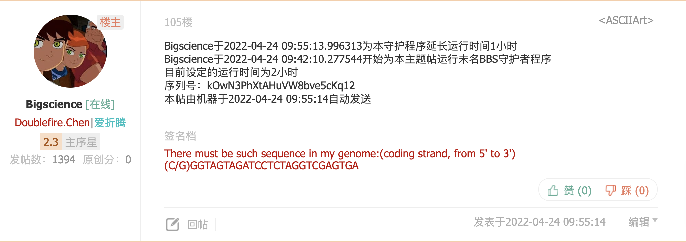
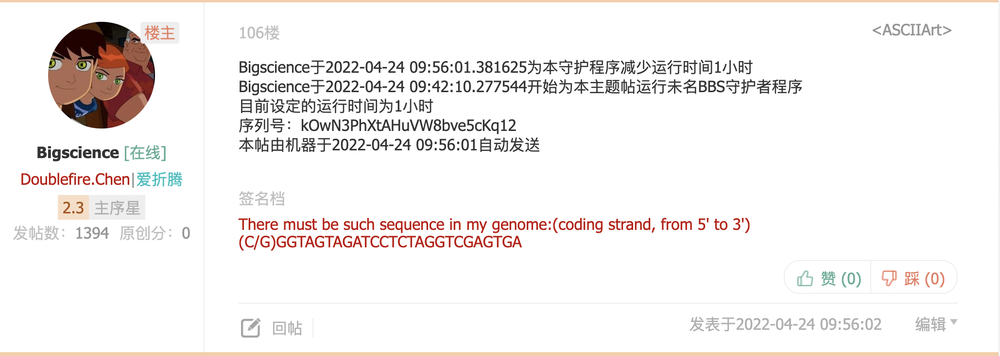
7. 五杀荣耀播报   
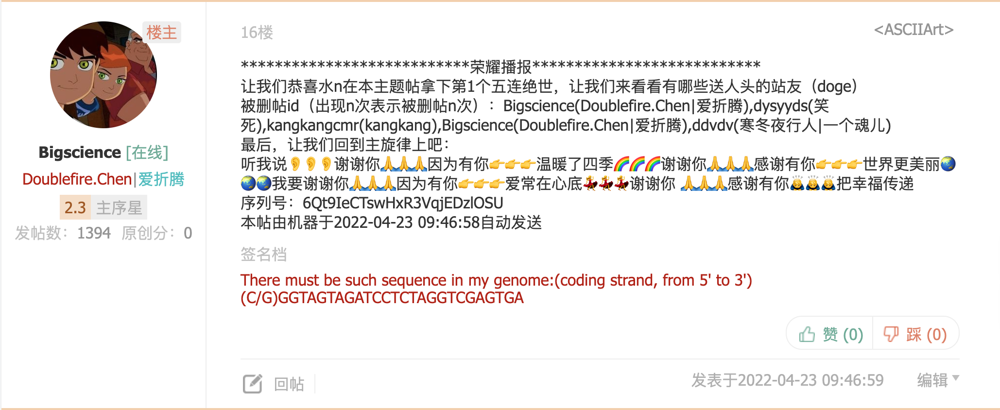
8. 守护通知全自动复活
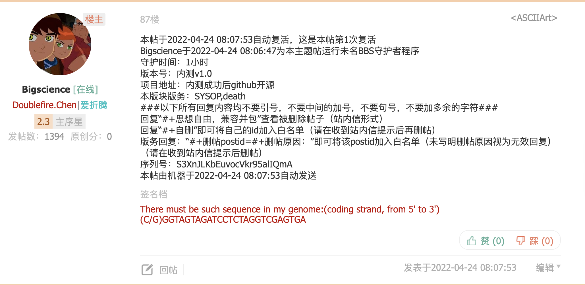
9. 炸楼全局广播（需要手动确认）  
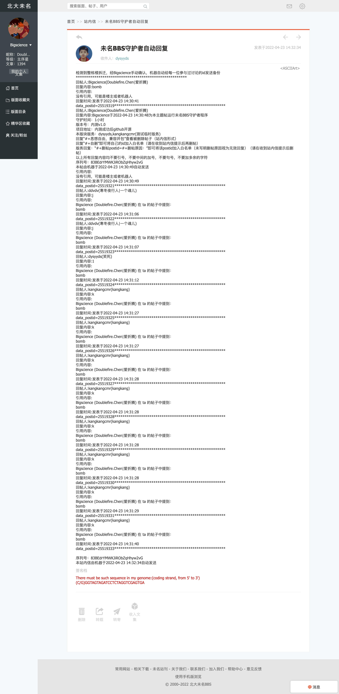 
10. 调戏（人机对话）水n功能（可选）  
## 食用指南  
打开```BBS_defender.py```文件，将配置区的内容补全，然后运行，根据提示输入url、守护时间即可，后续动态操作也有提示 
### 关于配置区参数的获取  
1. ```t```。谷歌浏览器（有开发者工具的浏览器都行）进入BBS https://bbs.pku.edu.cn/v2/home.php 打开开发者工具（快捷键：F12），然后登陆，在开发者工具Network选项下面找到login.php这个数据包，里面就有t值，如图：  
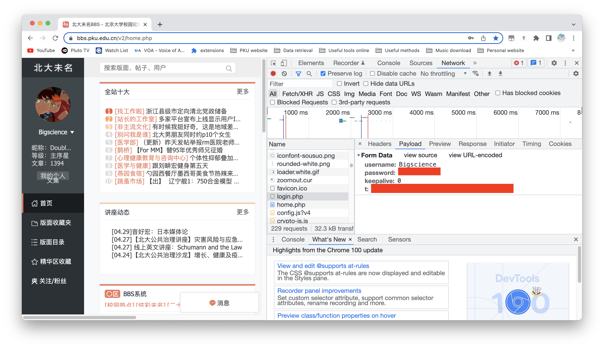  
## 鸣谢  
非常感谢下列所有站友帮助测试：（排名不分先后）  
['KakaHiguain', 'Sirius', 'Splindow', 'Seter', 'kkzhiyu', 'cylpku', 'ddvdv', 'jacksonfu', 'Kuroko', 'lxgzg', 'nokay', 'dysyyds', 'jzljlj', 'sugar', 'Raypotter', 'hgj', 'Lorry', 'krgkkkk', 'GWZZ', 'durr', 'kangkangcmr', 'shzmcxk', 'bbsatpku', 'vkzotto', 'tengjingshu', 'UDK']  